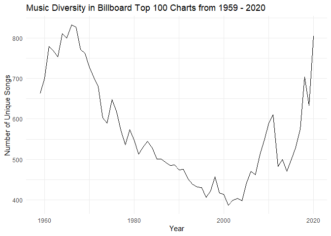
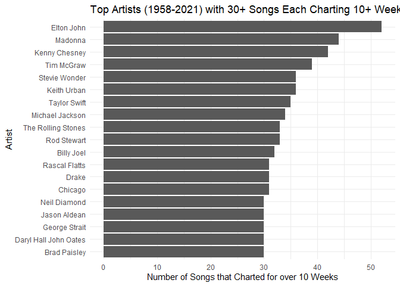

Exercises
================
Carissa Ing
2024-08-17

``` r
# Load libraries
library(readr)
library(tidyverse)
library(dplyr)
library(ggplot2)
```

``` r
billboard <- read_csv("billboard.csv") %>% 
  select(performer, 
         song,
         year,
         week,
         week_position)
```

    ## New names:
    ## Rows: 327895 Columns: 13
    ## ── Column specification
    ## ──────────────────────────────────────────────────────── Delimiter: "," chr
    ## (5): url, week_id, song, performer, song_id dbl (8): ...1, week_position,
    ## instance, previous_week_position, peak_positio...
    ## ℹ Use `spec()` to retrieve the full column specification for this data. ℹ
    ## Specify the column types or set `show_col_types = FALSE` to quiet this message.
    ## • `` -> `...1`

### Part A

**Caption:** This table shows the ten most popular songs and their
artists, ranked from most to least, based on the number of weeks each
song was charting on the Billboard Top 100 chart.

``` r
songs_charting <- billboard %>%
  group_by(performer, song) %>%
  summarise(count = n()) %>%
  arrange(desc(count))

head(songs_charting, 10)
```

    ## # A tibble: 10 × 3
    ## # Groups:   performer [10]
    ##    performer                                 song                          count
    ##    <chr>                                     <chr>                         <int>
    ##  1 Imagine Dragons                           Radioactive                      87
    ##  2 AWOLNATION                                Sail                             79
    ##  3 Jason Mraz                                I'm Yours                        76
    ##  4 The Weeknd                                Blinding Lights                  76
    ##  5 LeAnn Rimes                               How Do I Live                    69
    ##  6 LMFAO Featuring Lauren Bennett & GoonRock Party Rock Anthem                68
    ##  7 OneRepublic                               Counting Stars                   68
    ##  8 Adele                                     Rolling In The Deep              65
    ##  9 Jewel                                     Foolish Games/You Were Meant…    65
    ## 10 Carrie Underwood                          Before He Cheats                 64

### Part B

**Caption:** This graph maps the number of unique songs that appeared on
the Billboard Top 100 chart per year from 1959 to 2020, serving as a
measurement of musical diversity. There is a noticeable decline in the
number of unique songs starting around 1970, reaching a minimum in 2001.
Although there is a significant spike in musical diversity around 2010,
the number of unique songs does not return to pre-1970 levels until
2019.

``` r
songs_per_yr <- billboard %>% 
  filter(!(year %in% c(1958, 2021))) %>%
  group_by(year) %>% 
  summarise(num_unique_songs = n_distinct(paste(performer, song)))

ggplot(songs_per_yr, aes(x = year, y = num_unique_songs)) +
  geom_line() +
  labs(title = "Music Diversity in Billboard Top 100 Charts from 1959 - 2020", 
       y = "Number of Unique Songs", 
       x = "Year") +
  theme_minimal()
```

<!-- -->

### Part C

**Caption:** This graph displays the top artists from 1958 to 2021 who
have at least thirty songs that charted on the Billboard Top 100 for ten
or more weeks. Elton John stands out with the highest number of charting
songs, surpassing the second most popular artist by over ten songs.

``` r
ten_week_artists <- songs_charting %>% 
  filter(count >= 10) %>% #filter weeks charted >= 10
  group_by(performer) %>% 
  summarise(ten_week_hits = n()) %>% 
  filter(ten_week_hits >= 30)

ggplot(ten_week_artists, aes(fct_reorder(performer, ten_week_hits), ten_week_hits)) + 
  geom_col() +
  labs(title = "Top Artists (1958-2021) with 30+ Songs Each Charting 10+ Weeks", 
       y = "Number of Songs that Charted for over 10 Weeks", 
       x = "Artist") +
  coord_flip() +
  theme_minimal()
```

<!-- -->
