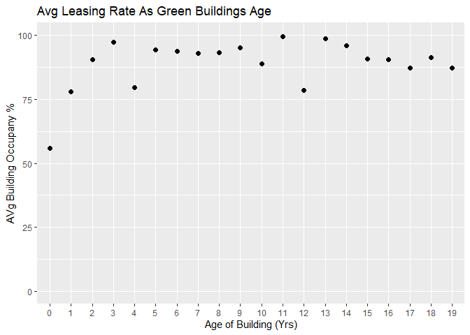
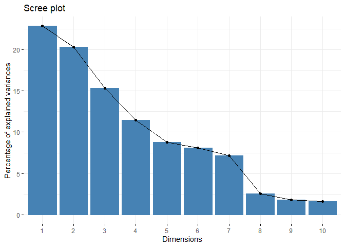
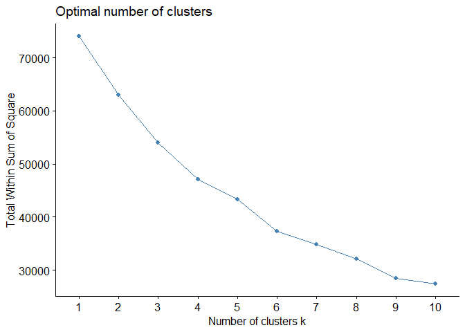

Visual Story Telling Part 1: Green Building
================
Carissa Ing
2024-08-19

``` r
library(readr)
library(tidyverse)
```

    ## Warning: package 'ggplot2' was built under R version 4.2.3

    ## Warning: package 'tibble' was built under R version 4.2.3

    ## Warning: package 'dplyr' was built under R version 4.2.3

    ## Warning: package 'lubridate' was built under R version 4.2.3

    ## ── Attaching core tidyverse packages ──────────────────────── tidyverse 2.0.0 ──
    ## ✔ dplyr     1.1.4     ✔ purrr     1.0.1
    ## ✔ forcats   1.0.0     ✔ stringr   1.5.0
    ## ✔ ggplot2   3.5.1     ✔ tibble    3.2.1
    ## ✔ lubridate 1.9.3     ✔ tidyr     1.3.0
    ## ── Conflicts ────────────────────────────────────────── tidyverse_conflicts() ──
    ## ✖ dplyr::filter() masks stats::filter()
    ## ✖ dplyr::lag()    masks stats::lag()
    ## ℹ Use the ]8;;http://conflicted.r-lib.org/conflicted package]8;; to force all conflicts to become errors

``` r
library(ggplot2)
library(factoextra)
```

    ## Warning: package 'factoextra' was built under R version 4.2.3

    ## Welcome! Want to learn more? See two factoextra-related books at https://goo.gl/ve3WBa

``` r
library(cluster)
```

``` r
buildings <- read_csv("greenbuildings.csv") 
```

## Clean Data

``` r
b <- buildings %>% 
  drop_na() %>%    
  filter(leasing_rate >= 0.1) %>% 
  select(-CS_PropertyID)
```

``` r
green <- b %>% filter(green_rating > 0)

not_green <- b %>% filter(green_rating < 1)
```

## Assumption 1: The square footage of a green building is approximately the same as that of a non-green building

``` r
print("Avg Rentable Sq Ft of Green Buildings:")
```

    ## [1] "Avg Rentable Sq Ft of Green Buildings:"

``` r
mean(green$size)
```

    ## [1] 326286.8

``` r
print("Avg Rentable Sq Ft of Non-Green Buildings:")
```

    ## [1] "Avg Rentable Sq Ft of Non-Green Buildings:"

``` r
mean(not_green$size)
```

    ## [1] 230138.7

The average square footage available for rent in green buildings is 1.4
times larger than in non-green buildings. If both were to achieve 100%
occupancy, a green building would generate 1.4 times more rental income
per square foot than a non-green building. This supports the guru’s
claim that the construction would be profitable. However, it is highly
unlikely for a building to be fully occupied in its first few years.

## Assumption 2: Green buildings are fully occupied, quickly.

``` r
green %>% 
  filter(age < 20) %>% 
  mutate(age = as.factor(age)) %>% 
  group_by(age) %>% 
  summarise(avg_leasing_rate = mean(leasing_rate)) %>% 
  ggplot(aes(x = age, y = avg_leasing_rate)) +
  geom_point(size = 2) +
  ylim(0, 100) +
  labs(
    title = "Avg Leasing Rate As Green Buildings Age",
    x = "Age of Building (Yrs)",
    y = "AVg Building Occupany %"
  )
```

<!-- -->

The figure above shows that green buildings, on average, do not achieve
over 90% occupancy until about their third year. The stats guru claimed
it would take at most 9 years to recoup the cost of development and
begin making a profit based on a 90% occupancy rate. However, that
timeline is likely to be extended by about 2 years. While a 2-year
extension is not significant given the typically long lifespan of green
buildings, it is still only an estimate, assuming green buildings earn
\$2.60 more per square foot than non-green buildings, as the stats guru
suggested. I will be clustering to find a more accurate estimate of this
rent difference.

## Clustering for Rent Difference

``` r
selected_features <- b %>%
  select(Rent, leasing_rate, size, stories, age, green_rating, cluster_rent, Precipitation, Gas_Costs, 
         Electricity_Costs)

selected_features <- na.omit(selected_features)

scaled_features <- scale(selected_features)
```

### Dimensionality Reduction

``` r
# Perform PCA
pca_result <- prcomp(scaled_features, scale. = TRUE)

#Choose num components based on >90% variance explained
fviz_eig(pca_result)
```

<!-- -->

``` r
selected_pca <- pca_result$x[, 1:8]
```

### K-Means Clustering

``` r
fviz_nbclust(selected_pca, kmeans, method = "wss")
```

<!-- -->

``` r
set.seed(85)
kmeans_result <- kmeans(selected_pca, centers = 6, nstart = 25)

b$kmeans_cluster <- kmeans_result$cluster
#fviz_cluster(kmeans_result, data = selected_pca)
```

``` r
green <- b %>% filter(green_rating >0)

not_green <- b %>% filter(green_rating < 1)
```

``` r
# See "centroids" of each cluster
ng_cluster_summary <- not_green %>%
  group_by(kmeans_cluster) %>%
  summarize(med_rent_ng = median(Rent),
            med_size_ng = median(size),
            med_stories_ng = median(stories))
            

g_cluster_summary <- green %>%
  filter(green_rating == 1) %>%
  group_by(kmeans_cluster) %>%
  summarize(med_rent_g = median(Rent),
            med_size_g = median(size),
            med_stories_g = median(stories))

combined_summary <- merge(g_cluster_summary, ng_cluster_summary, by = "kmeans_cluster", all = TRUE)

combined_summary <- combined_summary %>%
  select(kmeans_cluster, sort(names(combined_summary)[names(combined_summary) != "kmeans_cluster"]))

print(combined_summary)
```

    ##   kmeans_cluster med_rent_g med_rent_ng med_size_g med_size_ng med_stories_g
    ## 1              1         NA       27.50         NA       73061            NA
    ## 2              2         NA       19.50         NA      115452            NA
    ## 3              3     19.245       19.61   241928.5      186138          20.5
    ## 4              4     24.000       23.24  1221239.0      665819          53.0
    ## 5              5     27.860          NA   228926.0          NA          11.0
    ## 6              6     80.000       46.99   501417.0      183808          28.0
    ##   med_stories_ng
    ## 1              6
    ## 2             10
    ## 3             21
    ## 4             36
    ## 5             NA
    ## 6             12

The table above shows the median values for each cluster of green
buildings (denoted by the suffix “\_g”) and non-green buildings (denoted
by the suffix “\_ng”). Missing values indicate that there are no green
or non-green buildings within that cluster. For instance, clusters 1 and
2 group only non-green buildings, while cluster 5 contains only green
buildings. Clusters 3, 4, and 6 are less effective at distinguishing
between the two types.

The planned development is a 15-story, 250,000 sq ft building, which
will likely fall into cluster 5. Thus, the estimated future rent price
will be \$27.68 per sq ft.

Between clusters 1 and 2, which focus on non-green buildings, cluster 2
has median size and story values most similar to those in cluster 5 and
will serve as the standard of comparison. Cluster 2 has a median rent
price of \$19.50 per sq ft, meaning that green buildings are expected to
command about \$8.18 more per sq ft.

The total additional profit per year from building a green building
rather than a non-green one is \$8.18 × 250,000 sq ft = \$2,045,000. To
recoup the cost of development, it would take approximately \$5,000,000
/ \$2,045,000 = 2.44 years. Given this relatively short time span
compared to the long lifespan of green buildings, I agree with the stat
guru that proceeding with the green building is a profitable decision.
