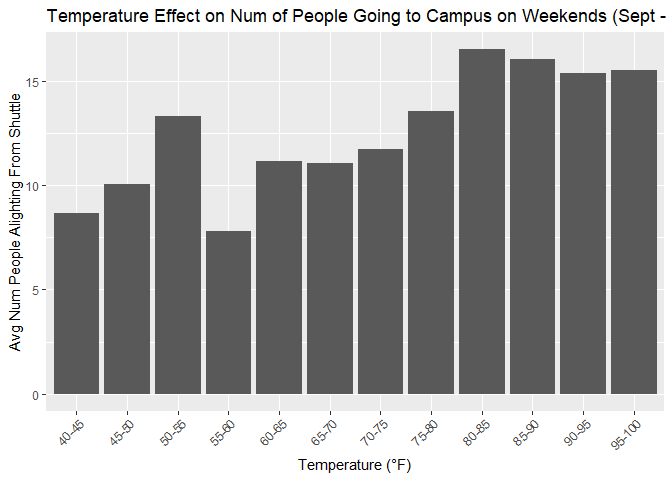

Visual Story Telling Part 2: CapMetro
================
Carissa Ing
2024-08-18

``` r
library(readr)
library(tidyverse)
library(ggplot2)
library(lubridate)
```

``` r
capmetro_UT <- read_csv("capmetro_UT.csv") %>% 
  mutate(
    day_of_week = factor(day_of_week, levels = c("Mon", "Tue", "Wed", "Thu", "Fri", "Sat", "Sun")),
    month = factor(month, levels = c("Sep", "Oct", "Nov")),
    time_only = format(timestamp, "%H:%M:%S"),
    time_only = as.POSIXct(time_only, format = "%H:%M:%S")
    )
```

## Busiest Days of the Week

``` r
capmetro_UT %>% 
  group_by(day_of_week) %>% 
  summarise(avg_activity = mean(boarding + alighting)) %>% 
  ggplot(aes(x = day_of_week, y = avg_activity)) +
  geom_col() +
  labs(
    title = "UT Shuttles' Busiest Days of the Week (Sept - Nov 2018)",
    x = "Day of the Week",
    y = "Avg Num Of People Using Shuttle From Campus"
  )
```

<!-- -->
In this graph displaying the average daily ridership on a CapMetro bus
from campus (including both boarding and alighting), it is evident that
weekdays experienced approximately six times the activity of weekends.
Tuesday had the highest number of boardings, while Sunday had the
lowest.

## Peak Hours on Weekdays vs. Weekends

``` r
capmetro_UT %>% 
  group_by(time_only, weekend) %>% 
  summarise(
    avg_boarded = mean(boarding),
    avg_alighted = mean(alighting)
  ) %>% 
  pivot_longer(cols = c(avg_boarded, avg_alighted), names_to = "activity", values_to = "avg_value") %>%
  ggplot(aes(x = time_only, y = avg_value, color = activity)) +
  geom_line(linewidth = 1) +
  labs(
    title = "UT Shuttles' Avg Activity Throughout Day (Sept - Nov 2018)",
    x = "Hour of Day",
    y = "Avg Num Of People Using Shuttle"
  ) +
  scale_x_datetime(date_breaks = "1 hour", date_labels = "%H") +
  scale_color_manual(
    name = "Passenger-Shuttle \nEngagement \nOn Campus", 
    values = c("avg_boarded" = "#0072B2", "avg_alighted" = "#bf5700"),
    labels = c('Alighting', 'Boarding')
  ) +
  facet_wrap(~ weekend, ncol = 1, scale = "free")
```

<!-- -->

The figure above compares the average number of people boarding and
alighting from UT shuttles throughout the day on weekdays versus
weekends. The graph depicting weekday activity illustrates a clear
pattern: most students arrive on campus between 7 and 11 a.m.\*\* and
leave between 2 and 6 p.m. The local peaks on the orange line likely
correspond to the times students need to arrive to be on time for class,
while the local peaks on the blue line probably represent the times of
the nearest scheduled buses after classes are dismissed. The lower graph
showing weekend activity indicates that ridership is approximately 80%
lower than peak weekday levels but remains relatively consistent from 9
a.m. to 9 p.m. for both boarders and alighters.

## Temperature’s Effect on Weekend Shuttle Activity

Unlike weekday shuttle usage, which is primarily driven by class
attendance, the purpose of weekend travel to campus varies and often
includes leisure activities. I aimed to explore whether and how
temperature impacts the number of people taking a shuttle to campus.

``` r
highlighted_points <- capmetro_UT %>% 
  filter(weekend == "weekend" & day(timestamp) ==13 & alighting > 50) 

capmetro_UT %>% 
  filter(weekend == "weekend") %>% 
  ggplot(aes(x = temperature, y = alighting)) +
  geom_point() +
  geom_point(data = highlighted_points, aes(x = temperature, y = alighting), color = "red", size = 3) +
  geom_text(data = highlighted_points, aes(x = temperature, y = alighting, label = format(timestamp, "%m/%d %I:%M%p")), vjust = 1, hjust = 1) +
  labs(
    title = "Temperature Effect on Num of People Going to Campus on Weekends (Sept - Nov 2018)",
    x = "Temperature (°F)",
    y = "Num People Alighting From Shuttle"
  )
```

<!-- -->

The graph above plots temperature against the number of people who took
a UT shuttle and alighted on campus. I noticed a few outliers with over
50 people arriving on campus on the same day. A quick search on the date
with the keywords “UT Austin” revealed that this was the day the Texas
Longhorn football team played against their long-time rivals, the Baylor
Bears, at their home stadium and won 23-17. The influx of people at 3:30
PM was likely due to attendance at the game, while the later peaks may
have been due to celebrations of the big win.

With the outliers, it is challenging to determine if temperature truly
affects the number of people coming to campus on weekends. Therefore, I
decided to remove the points with over 50 people alighting and bin the
temperatures to get a clearer view of the trend.

``` r
capmetro_UT <- capmetro_UT %>%
  mutate(temp_bin = cut(temperature,
                        breaks = seq(0, 100, by = 5),
                        labels = paste0(seq(0, 95, by = 5), "-", seq(5, 100, by = 5)),
                        include.lowest = TRUE))

capmetro_UT %>% 
  filter(weekend == "weekend", alighting < 50) %>% 
  group_by(temp_bin) %>%
  summarise(avg_alighted = mean(alighting, na.rm = TRUE)) %>% 
  ggplot(aes(x = temp_bin, y = avg_alighted)) +
  geom_col() +
  labs(
    title = "Temperature Effect on Num of People Going to Campus on Weekends (Sept - Nov 2018)",
    x = "Temperature (°F)",
    y = "Avg Num People Alighting From Shuttle"
  ) +
  theme(axis.text.x = element_text(angle = 45, hjust = 1))
```

<!-- -->

The figure above is a bar graph of the average number of people
alighting from the shuttle at campus on weekends, categorized by
5-degree temperature ranges. The graph indicates that higher weekend
temperatures are associated with slightly higher shuttle usage, while
lower temperatures correspond to slightly lower usage. Several factors
could contribute to this trend. For instance, people in Texas are more
accustomed to higher temperatures, so an 80-to-90-degree day feels
comfortable compared to the less frequent cooler weather. UT shuttles
are well air-conditioned, so individuals seeking relief from the heat
may opt to take the bus, thus increasing the average alighting count.
Additionally, hot September and October months coincide with peak sports
seasons, as noted in the previous graph, which may lead to higher
shuttle use for game attendance regardless of temperature. Conversely,
lower temperatures often coincide with the oncoming of the holiday
break, particularly in late November, resulting in fewer people on
campus to use the shuttle service.
