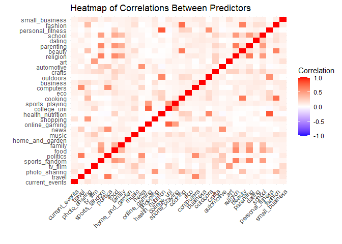
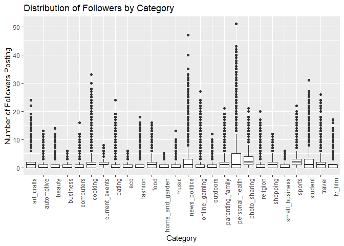
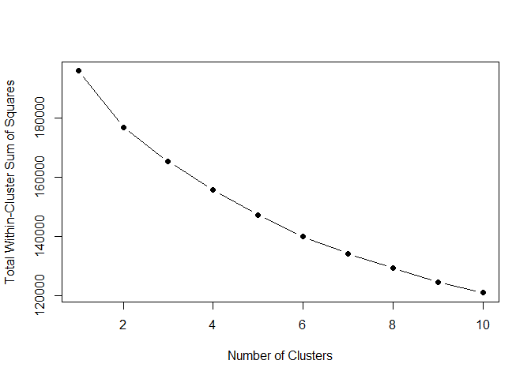
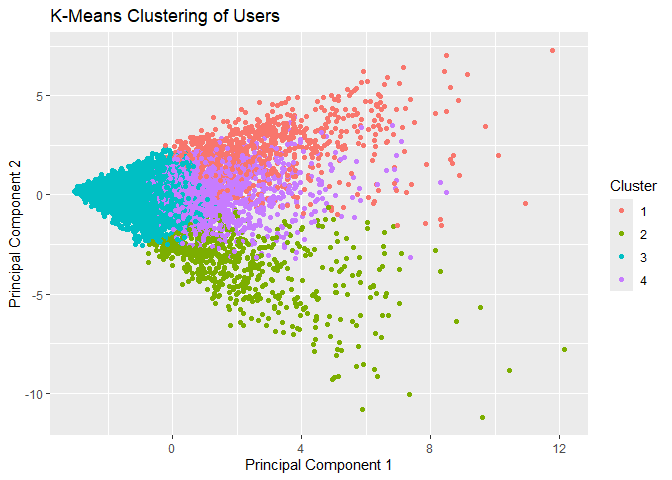
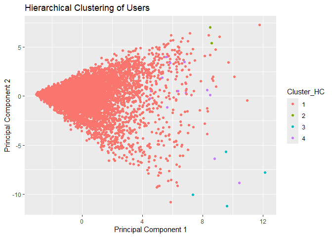

Market Segmentation
================
Carissa Ing
2024-08-18

``` r
library(readr)
library(dplyr)
library(tidyverse)
library(ggplot2)
library(reshape2)
library(cluster)
```

``` r
social_marketing <- read_csv("social_marketing.csv") %>% 
  select(-1) #remove row id
```

## Data Overview

``` r
sum(is.na(social_marketing))
```

    ## [1] 0

``` r
summary(social_marketing)
```

    ##     chatter       current_events      travel       photo_sharing   
    ##  Min.   : 0.000   Min.   :0.000   Min.   : 0.000   Min.   : 0.000  
    ##  1st Qu.: 2.000   1st Qu.:1.000   1st Qu.: 0.000   1st Qu.: 1.000  
    ##  Median : 3.000   Median :1.000   Median : 1.000   Median : 2.000  
    ##  Mean   : 4.399   Mean   :1.526   Mean   : 1.585   Mean   : 2.697  
    ##  3rd Qu.: 6.000   3rd Qu.:2.000   3rd Qu.: 2.000   3rd Qu.: 4.000  
    ##  Max.   :26.000   Max.   :8.000   Max.   :26.000   Max.   :21.000  
    ##  uncategorized      tv_film      sports_fandom       politics     
    ##  Min.   :0.000   Min.   : 0.00   Min.   : 0.000   Min.   : 0.000  
    ##  1st Qu.:0.000   1st Qu.: 0.00   1st Qu.: 0.000   1st Qu.: 0.000  
    ##  Median :1.000   Median : 1.00   Median : 1.000   Median : 1.000  
    ##  Mean   :0.813   Mean   : 1.07   Mean   : 1.594   Mean   : 1.789  
    ##  3rd Qu.:1.000   3rd Qu.: 1.00   3rd Qu.: 2.000   3rd Qu.: 2.000  
    ##  Max.   :9.000   Max.   :17.00   Max.   :20.000   Max.   :37.000  
    ##       food            family        home_and_garden      music        
    ##  Min.   : 0.000   Min.   : 0.0000   Min.   :0.0000   Min.   : 0.0000  
    ##  1st Qu.: 0.000   1st Qu.: 0.0000   1st Qu.:0.0000   1st Qu.: 0.0000  
    ##  Median : 1.000   Median : 1.0000   Median :0.0000   Median : 0.0000  
    ##  Mean   : 1.397   Mean   : 0.8639   Mean   :0.5207   Mean   : 0.6793  
    ##  3rd Qu.: 2.000   3rd Qu.: 1.0000   3rd Qu.:1.0000   3rd Qu.: 1.0000  
    ##  Max.   :16.000   Max.   :10.0000   Max.   :5.0000   Max.   :13.0000  
    ##       news        online_gaming       shopping      health_nutrition
    ##  Min.   : 0.000   Min.   : 0.000   Min.   : 0.000   Min.   : 0.000  
    ##  1st Qu.: 0.000   1st Qu.: 0.000   1st Qu.: 0.000   1st Qu.: 0.000  
    ##  Median : 0.000   Median : 0.000   Median : 1.000   Median : 1.000  
    ##  Mean   : 1.206   Mean   : 1.209   Mean   : 1.389   Mean   : 2.567  
    ##  3rd Qu.: 1.000   3rd Qu.: 1.000   3rd Qu.: 2.000   3rd Qu.: 3.000  
    ##  Max.   :20.000   Max.   :27.000   Max.   :12.000   Max.   :41.000  
    ##   college_uni     sports_playing      cooking            eco        
    ##  Min.   : 0.000   Min.   :0.0000   Min.   : 0.000   Min.   :0.0000  
    ##  1st Qu.: 0.000   1st Qu.:0.0000   1st Qu.: 0.000   1st Qu.:0.0000  
    ##  Median : 1.000   Median :0.0000   Median : 1.000   Median :0.0000  
    ##  Mean   : 1.549   Mean   :0.6392   Mean   : 1.998   Mean   :0.5123  
    ##  3rd Qu.: 2.000   3rd Qu.:1.0000   3rd Qu.: 2.000   3rd Qu.:1.0000  
    ##  Max.   :30.000   Max.   :8.0000   Max.   :33.000   Max.   :6.0000  
    ##    computers          business         outdoors           crafts      
    ##  Min.   : 0.0000   Min.   :0.0000   Min.   : 0.0000   Min.   :0.0000  
    ##  1st Qu.: 0.0000   1st Qu.:0.0000   1st Qu.: 0.0000   1st Qu.:0.0000  
    ##  Median : 0.0000   Median :0.0000   Median : 0.0000   Median :0.0000  
    ##  Mean   : 0.6491   Mean   :0.4232   Mean   : 0.7827   Mean   :0.5159  
    ##  3rd Qu.: 1.0000   3rd Qu.:1.0000   3rd Qu.: 1.0000   3rd Qu.:1.0000  
    ##  Max.   :16.0000   Max.   :6.0000   Max.   :12.0000   Max.   :7.0000  
    ##    automotive           art             religion          beauty       
    ##  Min.   : 0.0000   Min.   : 0.0000   Min.   : 0.000   Min.   : 0.0000  
    ##  1st Qu.: 0.0000   1st Qu.: 0.0000   1st Qu.: 0.000   1st Qu.: 0.0000  
    ##  Median : 0.0000   Median : 0.0000   Median : 0.000   Median : 0.0000  
    ##  Mean   : 0.8299   Mean   : 0.7248   Mean   : 1.095   Mean   : 0.7052  
    ##  3rd Qu.: 1.0000   3rd Qu.: 1.0000   3rd Qu.: 1.000   3rd Qu.: 1.0000  
    ##  Max.   :13.0000   Max.   :18.0000   Max.   :20.000   Max.   :14.0000  
    ##    parenting           dating            school        personal_fitness
    ##  Min.   : 0.0000   Min.   : 0.0000   Min.   : 0.0000   Min.   : 0.000  
    ##  1st Qu.: 0.0000   1st Qu.: 0.0000   1st Qu.: 0.0000   1st Qu.: 0.000  
    ##  Median : 0.0000   Median : 0.0000   Median : 0.0000   Median : 0.000  
    ##  Mean   : 0.9213   Mean   : 0.7109   Mean   : 0.7677   Mean   : 1.462  
    ##  3rd Qu.: 1.0000   3rd Qu.: 1.0000   3rd Qu.: 1.0000   3rd Qu.: 2.000  
    ##  Max.   :14.0000   Max.   :24.0000   Max.   :11.0000   Max.   :19.000  
    ##     fashion        small_business        spam             adult        
    ##  Min.   : 0.0000   Min.   :0.0000   Min.   :0.00000   Min.   : 0.0000  
    ##  1st Qu.: 0.0000   1st Qu.:0.0000   1st Qu.:0.00000   1st Qu.: 0.0000  
    ##  Median : 0.0000   Median :0.0000   Median :0.00000   Median : 0.0000  
    ##  Mean   : 0.9966   Mean   :0.3363   Mean   :0.00647   Mean   : 0.4033  
    ##  3rd Qu.: 1.0000   3rd Qu.:1.0000   3rd Qu.:0.00000   3rd Qu.: 0.0000  
    ##  Max.   :18.0000   Max.   :6.0000   Max.   :2.00000   Max.   :26.0000

## Data Cleaning & EDA

``` r
remove_bots <- social_marketing %>% 
  #Combine chatter and uncategorized
  mutate(chatter = chatter + uncategorized) %>% 
  select(-uncategorized) %>% 
  #Remove bots (any user whose spam/chatter/adult tweets make up >50% of their categories)
  mutate(
    total_cat = rowSums(., na.rm = TRUE), 
    bot_content_ratio = (spam + chatter + adult)/total_cat
  ) %>% 
  filter(bot_content_ratio < 0.5) %>% 
  select(
    -spam,
    -chatter, 
    -adult,
    -total_cat, 
    -bot_content_ratio)
```

``` r
#Correlation heatmap between predictors
correlation_matrix <- cor(remove_bots, use = "pairwise.complete.obs")
correlation_matrix_filtered <- ifelse(abs(correlation_matrix) > 0.8, correlation_matrix, 0)

correlation_melt <- melt(correlation_matrix)
ggplot(correlation_melt, aes(x = Var1, y = Var2, fill = value)) +
  geom_tile() +
  scale_fill_gradient2(low = "blue", high = "red", mid = "white", 
                       midpoint = 0, limit = c(-1, 1), name = "Correlation") +
  theme_minimal() +
  theme(axis.text.x = element_text(angle = 45, hjust = 1)) +
  labs(x = "", y = "", title = "Heatmap of Correlations Between Predictors")
```

<!-- -->

``` r
#combining some correlated and similarly-themed features
sm <- remove_bots %>% 
  mutate(
    personal_health = health_nutrition + personal_fitness,
    parenting_family = parenting + family,
    news_politics = news + politics,
    art_crafts = art + crafts,
    sports = sports_fandom + sports_playing,
    student = college_uni + school
  ) %>% 
  select(
    -health_nutrition, -personal_fitness,
    -parenting, -family,
    -news, -politics,
    -art, -crafts,
    -sports_fandom, -sports_playing,
    -college_uni, -school)
```

``` r
data_long <- sm %>% pivot_longer(everything(), names_to = "Category", values_to = "Followers")
ggplot(data_long, aes(x = Category, y = Followers)) +
  geom_boxplot() +
  theme(axis.text.x = element_text(angle = 90, hjust = 1)) +
  labs(title = "Distribution of Followers by Category", x = "Category", y = "Number of Followers Posting")
```

<!-- -->

## Segmentation

### K-Means Clustering

``` r
sm_scaled <- scale(sm %>% select(-personal_health))

#Choose # clusters with elbow curve
wss <- sapply(1:10, function(k) {
  kmeans(sm_scaled, centers = k, nstart = 10)$tot.withinss
})
```

    ## Warning: did not converge in 10 iterations

``` r
plot(1:10, wss, type = "b", pch = 19, xlab = "Number of Clusters", ylab = "Total Within-Cluster Sum of Squares")
```

<!-- -->

``` r
set.seed(5) # For reproducibility
kmeans_result <- kmeans(sm_scaled, centers = 4, nstart = 25)

# Add cluster assignments to the dataset
sm$Cluster <- as.factor(kmeans_result$cluster)

# Visualize the clusters (if using 2D or 3D PCA components for visualization)
sm_pca <- prcomp(sm_scaled)
sm$PC1 <- sm_pca$x[,1]
sm$PC2 <- sm_pca$x[,2]

ggplot(sm, aes(x = PC1, y = PC2, color = Cluster)) +
  geom_point() +
  labs(title = "K-Means Clustering of Users", x = "Principal Component 1", y = "Principal Component 2")
```

<!-- -->

``` r
# View the cluster centers
print(kmeans_result$centers)
```

    ##   current_events      travel photo_sharing     tv_film        food
    ## 1      0.1423584 -0.08174962    -0.0735336 -0.06480806  1.84033339
    ## 2      0.1744276 -0.03713142     1.1855643 -0.06815976 -0.16235067
    ## 3     -0.1264205 -0.23973021    -0.2538402 -0.21417289 -0.29607299
    ## 4      0.2260881  0.72607570     0.3169491  0.65758051  0.03694157
    ##   home_and_garden       music online_gaming     shopping     cooking
    ## 1       0.1994118  0.02243549    0.03835628  0.004423272 -0.09220465
    ## 2       0.1261696  0.50673857    0.01007416  0.268236169  2.58443185
    ## 3      -0.1439222 -0.20990379   -0.19420927 -0.174878518 -0.26610038
    ## 4       0.2663850  0.39578327    0.52498786  0.392402769 -0.14900664
    ##           eco   computers    business   outdoors  automotive   religion
    ## 1  0.20431040  0.10420243  0.08919351  0.0215489  0.16156907  2.2445454
    ## 2  0.06968213  0.08055703  0.22224552  0.1063961  0.05608664 -0.1253679
    ## 3 -0.14487816 -0.24423087 -0.19985715 -0.1036153 -0.19374665 -0.3137249
    ## 4  0.28735769  0.60948858  0.44003286  0.2428217  0.44967872 -0.1146979
    ##       beauty      dating      fashion small_business parenting_family
    ## 1  0.2788044 -0.01232709 -0.006612776     0.07192565       2.09838748
    ## 2  2.3573597  0.06034405  2.443671042     0.22718806      -0.03285140
    ## 3 -0.2915217 -0.12640448 -0.283692752    -0.21049968      -0.32757407
    ## 4 -0.1672484  0.33945184 -0.088049859     0.47620558      -0.04147654
    ##   news_politics art_crafts      sports     student
    ## 1   -0.12441173  0.3033788  1.83638775  0.54172520
    ## 2   -0.08437074  0.1189629 -0.08616549  0.06228612
    ## 3   -0.26085535 -0.2489582 -0.35389828 -0.33606533
    ## 4    0.82253870  0.5162491  0.17375977  0.67121867

``` r
cluster_counts <- table(kmeans_result$cluster)
cluster_ratios <- cluster_counts/nrow(sm)

cluster_summary <- data.frame(
  Cluster = names(cluster_counts),
  Count = as.vector(cluster_counts),
  Ratio = cluster_ratios
)

# Print the summary
print(cluster_summary)
```

    ##   Cluster Count Ratio.Var1 Ratio.Freq
    ## 1       1   784          1 0.10010215
    ## 2       2   614          2 0.07839632
    ## 3       3  4747          3 0.60610317
    ## 4       4  1687          4 0.21539837

### Hierarchical CLustering

``` r
dist_matrix <- dist(sm_scaled, method = "euclidean")

hc <- hclust(dist_matrix, method = "average")

clusters <- cutree(hc, k = 4)
sm$Cluster_HC <- as.factor(clusters)
```

``` r
# Perform PCA for visualization
pca_result <- prcomp(sm_scaled)
sm$PC1 <- pca_result$x[, 1]
sm$PC2 <- pca_result$x[, 2]

# Plot clusters
ggplot(sm, aes(x = PC1, y = PC2, color = Cluster_HC)) +
  geom_point() +
  labs(title = "Hierarchical Clustering of Users", x = "Principal Component 1", y = "Principal Component 2")
```

<!-- -->

``` r
# Compute mean values for each cluster
cluster_profiles <- sm %>%
  group_by(Cluster_HC) %>%
  summarise(across(starts_with("Category"), mean))

print(cluster_profiles)
```

    ## # A tibble: 4 × 1
    ##   Cluster_HC
    ##   <fct>     
    ## 1 1         
    ## 2 2         
    ## 3 3         
    ## 4 4
