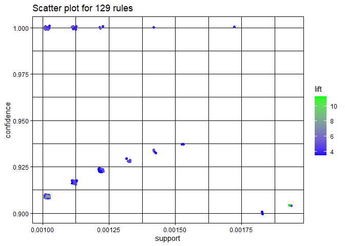
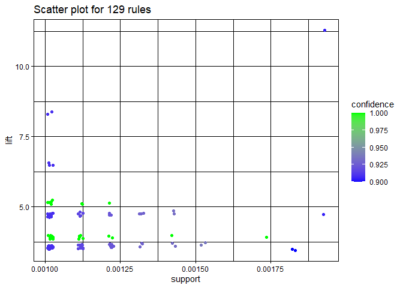

Association Rule Mining
================
Carissa Ing
2024-08-18

``` r
library(readr)
library(tidyverse)
```

    ## ── Attaching core tidyverse packages ──────────────────────── tidyverse 2.0.0 ──
    ## ✔ dplyr     1.1.4     ✔ purrr     1.0.1
    ## ✔ forcats   1.0.0     ✔ stringr   1.5.0
    ## ✔ ggplot2   3.5.1     ✔ tibble    3.2.1
    ## ✔ lubridate 1.9.3     ✔ tidyr     1.3.0
    ## ── Conflicts ────────────────────────────────────────── tidyverse_conflicts() ──
    ## ✖ dplyr::filter() masks stats::filter()
    ## ✖ dplyr::lag()    masks stats::lag()
    ## ℹ Use the ]8;;http://conflicted.r-lib.org/conflicted package]8;; to force all conflicts to become errors

``` r
library(igraph)
```

    ## 
    ## Attaching package: 'igraph'
    ## 
    ## The following objects are masked from 'package:lubridate':
    ## 
    ##     %--%, union
    ## 
    ## The following objects are masked from 'package:dplyr':
    ## 
    ##     as_data_frame, groups, union
    ## 
    ## The following objects are masked from 'package:purrr':
    ## 
    ##     compose, simplify
    ## 
    ## The following object is masked from 'package:tidyr':
    ## 
    ##     crossing
    ## 
    ## The following object is masked from 'package:tibble':
    ## 
    ##     as_data_frame
    ## 
    ## The following objects are masked from 'package:stats':
    ## 
    ##     decompose, spectrum
    ## 
    ## The following object is masked from 'package:base':
    ## 
    ##     union

``` r
library(arules)
```

    ## Loading required package: Matrix
    ## 
    ## Attaching package: 'Matrix'
    ## 
    ## The following objects are masked from 'package:tidyr':
    ## 
    ##     expand, pack, unpack
    ## 
    ## 
    ## Attaching package: 'arules'
    ## 
    ## The following object is masked from 'package:dplyr':
    ## 
    ##     recode
    ## 
    ## The following objects are masked from 'package:base':
    ## 
    ##     abbreviate, write

``` r
library(arulesViz)
```

## Prepping Data

``` r
# Read the data from the text file
groceries <- read_lines("groceries.txt")

# Convert the data to a transactions object
groceries_list <- strsplit(groceries, ",")
groceries_list <- lapply(groceries_list, unique)
groceries_trans <- as(groceries_list, "transactions")

inspect(groceries_trans[1:5])
```

    ##     items                      
    ## [1] {citrus fruit,             
    ##      margarine,                
    ##      ready soups,              
    ##      semi-finished bread}      
    ## [2] {coffee,                   
    ##      tropical fruit,           
    ##      yogurt}                   
    ## [3] {whole milk}               
    ## [4] {cream cheese ,            
    ##      meat spreads,             
    ##      pip fruit,                
    ##      yogurt}                   
    ## [5] {condensed milk,           
    ##      long life bakery product, 
    ##      other vegetables,         
    ##      whole milk}

``` r
summary(groceries_trans)
```

    ## transactions as itemMatrix in sparse format with
    ##  9835 rows (elements/itemsets/transactions) and
    ##  169 columns (items) and a density of 0.02609146 
    ## 
    ## most frequent items:
    ##       whole milk other vegetables       rolls/buns             soda 
    ##             2513             1903             1809             1715 
    ##           yogurt          (Other) 
    ##             1372            34055 
    ## 
    ## element (itemset/transaction) length distribution:
    ## sizes
    ##    1    2    3    4    5    6    7    8    9   10   11   12   13   14   15   16 
    ## 2159 1643 1299 1005  855  645  545  438  350  246  182  117   78   77   55   46 
    ##   17   18   19   20   21   22   23   24   26   27   28   29   32 
    ##   29   14   14    9   11    4    6    1    1    1    1    3    1 
    ## 
    ##    Min. 1st Qu.  Median    Mean 3rd Qu.    Max. 
    ##   1.000   2.000   3.000   4.409   6.000  32.000 
    ## 
    ## includes extended item information - examples:
    ##             labels
    ## 1 abrasive cleaner
    ## 2 artif. sweetener
    ## 3   baby cosmetics

## Finding Association Rules

I chose a support of 0.5% and a confidence of 90% because I wanted to
focus on the stronger association rules that were verified about 10
times.

``` r
grocery_rules <- apriori(groceries_trans, parameter = list(supp = 0.001, conf = 0.9))
```

    ## Apriori
    ## 
    ## Parameter specification:
    ##  confidence minval smax arem  aval originalSupport maxtime support minlen
    ##         0.9    0.1    1 none FALSE            TRUE       5   0.001      1
    ##  maxlen target  ext
    ##      10  rules TRUE
    ## 
    ## Algorithmic control:
    ##  filter tree heap memopt load sort verbose
    ##     0.1 TRUE TRUE  FALSE TRUE    2    TRUE
    ## 
    ## Absolute minimum support count: 9 
    ## 
    ## set item appearances ...[0 item(s)] done [0.00s].
    ## set transactions ...[169 item(s), 9835 transaction(s)] done [0.01s].
    ## sorting and recoding items ... [157 item(s)] done [0.00s].
    ## creating transaction tree ... done [0.00s].
    ## checking subsets of size 1 2 3 4 5 6 done [0.01s].
    ## writing ... [129 rule(s)] done [0.00s].
    ## creating S4 object  ... done [0.00s].

``` r
inspect(grocery_rules)
```

    ##       lhs                            rhs                    support confidence    coverage      lift count
    ## [1]   {liquor,                                                                                            
    ##        red/blush wine}            => {bottled beer}     0.001931876  0.9047619 0.002135231 11.235269    19
    ## [2]   {cereals,                                                                                           
    ##        curd}                      => {whole milk}       0.001016777  0.9090909 0.001118454  3.557863    10
    ## [3]   {bottled beer,                                                                                      
    ##        soups}                     => {whole milk}       0.001118454  0.9166667 0.001220132  3.587512    11
    ## [4]   {house keeping products,                                                                            
    ##        whipped/sour cream}        => {whole milk}       0.001220132  0.9230769 0.001321810  3.612599    12
    ## [5]   {pastry,                                                                                            
    ##        sweet spreads}             => {whole milk}       0.001016777  0.9090909 0.001118454  3.557863    10
    ## [6]   {rice,                                                                                              
    ##        sugar}                     => {whole milk}       0.001220132  1.0000000 0.001220132  3.913649    12
    ## [7]   {bottled water,                                                                                     
    ##        rice}                      => {whole milk}       0.001220132  0.9230769 0.001321810  3.612599    12
    ## [8]   {canned fish,                                                                                       
    ##        hygiene articles}          => {whole milk}       0.001118454  1.0000000 0.001118454  3.913649    11
    ## [9]   {grapes,                                                                                            
    ##        onions}                    => {other vegetables} 0.001118454  0.9166667 0.001220132  4.737476    11
    ## [10]  {hard cheese,                                                                                       
    ##        oil}                       => {other vegetables} 0.001118454  0.9166667 0.001220132  4.737476    11
    ## [11]  {butter,                                                                                            
    ##        rice,                                                                                              
    ##        root vegetables}           => {whole milk}       0.001016777  1.0000000 0.001016777  3.913649    10
    ## [12]  {fruit/vegetable juice,                                                                             
    ##        herbs,                                                                                             
    ##        whole milk}                => {other vegetables} 0.001016777  0.9090909 0.001118454  4.698323    10
    ## [13]  {citrus fruit,                                                                                      
    ##        herbs,                                                                                             
    ##        tropical fruit}            => {whole milk}       0.001118454  0.9166667 0.001220132  3.587512    11
    ## [14]  {flour,                                                                                             
    ##        root vegetables,                                                                                   
    ##        whipped/sour cream}        => {whole milk}       0.001728521  1.0000000 0.001728521  3.913649    17
    ## [15]  {butter,                                                                                            
    ##        domestic eggs,                                                                                     
    ##        soft cheese}               => {whole milk}       0.001016777  1.0000000 0.001016777  3.913649    10
    ## [16]  {soft cheese,                                                                                       
    ##        tropical fruit,                                                                                    
    ##        whipped/sour cream}        => {other vegetables} 0.001220132  0.9230769 0.001321810  4.770605    12
    ## [17]  {root vegetables,                                                                                   
    ##        soft cheese,                                                                                       
    ##        whipped/sour cream}        => {whole milk}       0.001220132  0.9230769 0.001321810  3.612599    12
    ## [18]  {citrus fruit,                                                                                      
    ##        root vegetables,                                                                                   
    ##        soft cheese}               => {other vegetables} 0.001016777  1.0000000 0.001016777  5.168156    10
    ## [19]  {frankfurter,                                                                                       
    ##        frozen meals,                                                                                      
    ##        tropical fruit}            => {other vegetables} 0.001016777  0.9090909 0.001118454  4.698323    10
    ## [20]  {frankfurter,                                                                                       
    ##        frozen meals,                                                                                      
    ##        tropical fruit}            => {whole milk}       0.001016777  0.9090909 0.001118454  3.557863    10
    ## [21]  {butter,                                                                                            
    ##        frozen meals,                                                                                      
    ##        tropical fruit}            => {whole milk}       0.001016777  0.9090909 0.001118454  3.557863    10
    ## [22]  {hard cheese,                                                                                       
    ##        tropical fruit,                                                                                    
    ##        whipped/sour cream}        => {other vegetables} 0.001016777  0.9090909 0.001118454  4.698323    10
    ## [23]  {butter milk,                                                                                       
    ##        pork,                                                                                              
    ##        whole milk}                => {other vegetables} 0.001016777  0.9090909 0.001118454  4.698323    10
    ## [24]  {butter milk,                                                                                       
    ##        fruit/vegetable juice,                                                                             
    ##        pip fruit}                 => {other vegetables} 0.001016777  0.9090909 0.001118454  4.698323    10
    ## [25]  {frankfurter,                                                                                       
    ##        root vegetables,                                                                                   
    ##        sliced cheese}             => {whole milk}       0.001016777  0.9090909 0.001118454  3.557863    10
    ## [26]  {butter,                                                                                            
    ##        sliced cheese,                                                                                     
    ##        whipped/sour cream}        => {whole milk}       0.001220132  0.9230769 0.001321810  3.612599    12
    ## [27]  {coffee,                                                                                            
    ##        oil,                                                                                               
    ##        yogurt}                    => {other vegetables} 0.001016777  0.9090909 0.001118454  4.698323    10
    ## [28]  {napkins,                                                                                           
    ##        onions,                                                                                            
    ##        root vegetables}           => {other vegetables} 0.001016777  0.9090909 0.001118454  4.698323    10
    ## [29]  {berries,                                                                                           
    ##        butter,                                                                                            
    ##        sausage}                   => {whole milk}       0.001016777  0.9090909 0.001118454  3.557863    10
    ## [30]  {hamburger meat,                                                                                    
    ##        tropical fruit,                                                                                    
    ##        whipped/sour cream}        => {other vegetables} 0.001016777  0.9090909 0.001118454  4.698323    10
    ## [31]  {butter,                                                                                            
    ##        hygiene articles,                                                                                  
    ##        napkins}                   => {whole milk}       0.001016777  0.9090909 0.001118454  3.557863    10
    ## [32]  {butter,                                                                                            
    ##        hygiene articles,                                                                                  
    ##        pip fruit}                 => {whole milk}       0.001016777  1.0000000 0.001016777  3.913649    10
    ## [33]  {butter,                                                                                            
    ##        hygiene articles,                                                                                  
    ##        tropical fruit}            => {whole milk}       0.001220132  0.9230769 0.001321810  3.612599    12
    ## [34]  {domestic eggs,                                                                                     
    ##        hygiene articles,                                                                                  
    ##        tropical fruit}            => {whole milk}       0.001220132  0.9230769 0.001321810  3.612599    12
    ## [35]  {hygiene articles,                                                                                  
    ##        root vegetables,                                                                                   
    ##        whipped/sour cream}        => {whole milk}       0.001016777  1.0000000 0.001016777  3.913649    10
    ## [36]  {hygiene articles,                                                                                  
    ##        pip fruit,                                                                                         
    ##        root vegetables}           => {whole milk}       0.001016777  1.0000000 0.001016777  3.913649    10
    ## [37]  {cream cheese ,                                                                                     
    ##        domestic eggs,                                                                                     
    ##        sugar}                     => {whole milk}       0.001118454  1.0000000 0.001118454  3.913649    11
    ## [38]  {cream cheese ,                                                                                     
    ##        other vegetables,                                                                                  
    ##        sugar}                     => {whole milk}       0.001525165  0.9375000 0.001626843  3.669046    15
    ## [39]  {curd,                                                                                              
    ##        domestic eggs,                                                                                     
    ##        sugar}                     => {whole milk}       0.001016777  1.0000000 0.001016777  3.913649    10
    ## [40]  {citrus fruit,                                                                                      
    ##        domestic eggs,                                                                                     
    ##        sugar}                     => {whole milk}       0.001423488  0.9333333 0.001525165  3.652739    14
    ## [41]  {domestic eggs,                                                                                     
    ##        sugar,                                                                                             
    ##        tropical fruit}            => {whole milk}       0.001118454  0.9166667 0.001220132  3.587512    11
    ## [42]  {domestic eggs,                                                                                     
    ##        sugar,                                                                                             
    ##        yogurt}                    => {whole milk}       0.001423488  0.9333333 0.001525165  3.652739    14
    ## [43]  {root vegetables,                                                                                   
    ##        sugar,                                                                                             
    ##        whipped/sour cream}        => {whole milk}       0.001220132  0.9230769 0.001321810  3.612599    12
    ## [44]  {pork,                                                                                              
    ##        rolls/buns,                                                                                        
    ##        waffles}                   => {whole milk}       0.001016777  0.9090909 0.001118454  3.557863    10
    ## [45]  {long life bakery product,                                                                          
    ##        napkins,                                                                                           
    ##        whipped/sour cream}        => {whole milk}       0.001016777  0.9090909 0.001118454  3.557863    10
    ## [46]  {long life bakery product,                                                                          
    ##        napkins,                                                                                           
    ##        tropical fruit}            => {whole milk}       0.001220132  0.9230769 0.001321810  3.612599    12
    ## [47]  {butter,                                                                                            
    ##        long life bakery product,                                                                          
    ##        sausage}                   => {whole milk}       0.001016777  0.9090909 0.001118454  3.557863    10
    ## [48]  {dessert,                                                                                           
    ##        tropical fruit,                                                                                    
    ##        whipped/sour cream}        => {other vegetables} 0.001118454  0.9166667 0.001220132  4.737476    11
    ## [49]  {cream cheese ,                                                                                     
    ##        domestic eggs,                                                                                     
    ##        napkins}                   => {whole milk}       0.001118454  1.0000000 0.001118454  3.913649    11
    ## [50]  {butter,                                                                                            
    ##        cream cheese ,                                                                                     
    ##        root vegetables}           => {yogurt}           0.001016777  0.9090909 0.001118454  6.516698    10
    ## [51]  {butter,                                                                                            
    ##        cream cheese ,                                                                                     
    ##        root vegetables}           => {whole milk}       0.001016777  0.9090909 0.001118454  3.557863    10
    ## [52]  {cream cheese ,                                                                                     
    ##        pip fruit,                                                                                         
    ##        whipped/sour cream}        => {whole milk}       0.001321810  0.9285714 0.001423488  3.634103    13
    ## [53]  {cream cheese ,                                                                                     
    ##        pip fruit,                                                                                         
    ##        sausage}                   => {whole milk}       0.001016777  0.9090909 0.001118454  3.557863    10
    ## [54]  {citrus fruit,                                                                                      
    ##        cream cheese ,                                                                                     
    ##        root vegetables}           => {other vegetables} 0.001220132  0.9230769 0.001321810  4.770605    12
    ## [55]  {butter,                                                                                            
    ##        root vegetables,                                                                                   
    ##        white bread}               => {whole milk}       0.001118454  0.9166667 0.001220132  3.587512    11
    ## [56]  {butter,                                                                                            
    ##        coffee,                                                                                            
    ##        whipped/sour cream}        => {whole milk}       0.001220132  0.9230769 0.001321810  3.612599    12
    ## [57]  {coffee,                                                                                            
    ##        domestic eggs,                                                                                     
    ##        root vegetables}           => {whole milk}       0.001016777  0.9090909 0.001118454  3.557863    10
    ## [58]  {butter,                                                                                            
    ##        curd,                                                                                              
    ##        domestic eggs}             => {whole milk}       0.001118454  0.9166667 0.001220132  3.587512    11
    ## [59]  {butter,                                                                                            
    ##        citrus fruit,                                                                                      
    ##        curd}                      => {whole milk}       0.001118454  0.9166667 0.001220132  3.587512    11
    ## [60]  {bottled beer,                                                                                      
    ##        domestic eggs,                                                                                     
    ##        margarine}                 => {whole milk}       0.001016777  0.9090909 0.001118454  3.557863    10
    ## [61]  {brown bread,                                                                                       
    ##        pip fruit,                                                                                         
    ##        whipped/sour cream}        => {other vegetables} 0.001118454  1.0000000 0.001118454  5.168156    11
    ## [62]  {domestic eggs,                                                                                     
    ##        fruit/vegetable juice,                                                                             
    ##        margarine}                 => {whole milk}       0.001118454  0.9166667 0.001220132  3.587512    11
    ## [63]  {butter,                                                                                            
    ##        pip fruit,                                                                                         
    ##        whipped/sour cream}        => {whole milk}       0.001830198  0.9000000 0.002033554  3.522284    18
    ## [64]  {butter,                                                                                            
    ##        soda,                                                                                              
    ##        whipped/sour cream}        => {other vegetables} 0.001321810  0.9285714 0.001423488  4.799002    13
    ## [65]  {butter,                                                                                            
    ##        pastry,                                                                                            
    ##        pip fruit}                 => {other vegetables} 0.001321810  0.9285714 0.001423488  4.799002    13
    ## [66]  {domestic eggs,                                                                                     
    ##        tropical fruit,                                                                                    
    ##        whipped/sour cream}        => {whole milk}       0.001830198  0.9000000 0.002033554  3.522284    18
    ## [67]  {fruit/vegetable juice,                                                                             
    ##        tropical fruit,                                                                                    
    ##        whipped/sour cream}        => {other vegetables} 0.001931876  0.9047619 0.002135231  4.675950    19
    ## [68]  {other vegetables,                                                                                  
    ##        rice,                                                                                              
    ##        root vegetables,                                                                                   
    ##        yogurt}                    => {whole milk}       0.001321810  0.9285714 0.001423488  3.634103    13
    ## [69]  {rice,                                                                                              
    ##        root vegetables,                                                                                   
    ##        whole milk,                                                                                        
    ##        yogurt}                    => {other vegetables} 0.001321810  0.9285714 0.001423488  4.799002    13
    ## [70]  {herbs,                                                                                             
    ##        other vegetables,                                                                                  
    ##        root vegetables,                                                                                   
    ##        tropical fruit}            => {whole milk}       0.001016777  0.9090909 0.001118454  3.557863    10
    ## [71]  {grapes,                                                                                            
    ##        tropical fruit,                                                                                    
    ##        whole milk,                                                                                        
    ##        yogurt}                    => {other vegetables} 0.001016777  1.0000000 0.001016777  5.168156    10
    ## [72]  {frozen meals,                                                                                      
    ##        pip fruit,                                                                                         
    ##        tropical fruit,                                                                                    
    ##        yogurt}                    => {whole milk}       0.001016777  0.9090909 0.001118454  3.557863    10
    ## [73]  {hard cheese,                                                                                       
    ##        other vegetables,                                                                                  
    ##        root vegetables,                                                                                   
    ##        yogurt}                    => {whole milk}       0.001220132  0.9230769 0.001321810  3.612599    12
    ## [74]  {ham,                                                                                               
    ##        pip fruit,                                                                                         
    ##        tropical fruit,                                                                                    
    ##        yogurt}                    => {other vegetables} 0.001016777  1.0000000 0.001016777  5.168156    10
    ## [75]  {ham,                                                                                               
    ##        pip fruit,                                                                                         
    ##        tropical fruit,                                                                                    
    ##        whole milk}                => {other vegetables} 0.001118454  1.0000000 0.001118454  5.168156    11
    ## [76]  {butter,                                                                                            
    ##        sliced cheese,                                                                                     
    ##        tropical fruit,                                                                                    
    ##        yogurt}                    => {whole milk}       0.001016777  0.9090909 0.001118454  3.557863    10
    ## [77]  {butter,                                                                                            
    ##        sliced cheese,                                                                                     
    ##        tropical fruit,                                                                                    
    ##        whole milk}                => {yogurt}           0.001016777  0.9090909 0.001118454  6.516698    10
    ## [78]  {oil,                                                                                               
    ##        root vegetables,                                                                                   
    ##        tropical fruit,                                                                                    
    ##        yogurt}                    => {other vegetables} 0.001016777  0.9090909 0.001118454  4.698323    10
    ## [79]  {oil,                                                                                               
    ##        root vegetables,                                                                                   
    ##        tropical fruit,                                                                                    
    ##        yogurt}                    => {whole milk}       0.001118454  1.0000000 0.001118454  3.913649    11
    ## [80]  {oil,                                                                                               
    ##        other vegetables,                                                                                  
    ##        root vegetables,                                                                                   
    ##        yogurt}                    => {whole milk}       0.001423488  1.0000000 0.001423488  3.913649    14
    ## [81]  {oil,                                                                                               
    ##        root vegetables,                                                                                   
    ##        whole milk,                                                                                        
    ##        yogurt}                    => {other vegetables} 0.001423488  0.9333333 0.001525165  4.823612    14
    ## [82]  {other vegetables,                                                                                  
    ##        root vegetables,                                                                                   
    ##        waffles,                                                                                           
    ##        yogurt}                    => {whole milk}       0.001016777  0.9090909 0.001118454  3.557863    10
    ## [83]  {cream cheese ,                                                                                     
    ##        curd,                                                                                              
    ##        other vegetables,                                                                                  
    ##        whipped/sour cream}        => {yogurt}           0.001016777  0.9090909 0.001118454  6.516698    10
    ## [84]  {citrus fruit,                                                                                      
    ##        cream cheese ,                                                                                     
    ##        whipped/sour cream,                                                                                
    ##        whole milk}                => {other vegetables} 0.001118454  0.9166667 0.001220132  4.737476    11
    ## [85]  {cream cheese ,                                                                                     
    ##        other vegetables,                                                                                  
    ##        pip fruit,                                                                                         
    ##        root vegetables}           => {whole milk}       0.001016777  0.9090909 0.001118454  3.557863    10
    ## [86]  {cream cheese ,                                                                                     
    ##        other vegetables,                                                                                  
    ##        pip fruit,                                                                                         
    ##        yogurt}                    => {whole milk}       0.001118454  0.9166667 0.001220132  3.587512    11
    ## [87]  {butter,                                                                                            
    ##        tropical fruit,                                                                                    
    ##        white bread,                                                                                       
    ##        yogurt}                    => {other vegetables} 0.001016777  0.9090909 0.001118454  4.698323    10
    ## [88]  {butter,                                                                                            
    ##        other vegetables,                                                                                  
    ##        tropical fruit,                                                                                    
    ##        white bread}               => {yogurt}           0.001016777  0.9090909 0.001118454  6.516698    10
    ## [89]  {butter,                                                                                            
    ##        other vegetables,                                                                                  
    ##        root vegetables,                                                                                   
    ##        white bread}               => {whole milk}       0.001016777  1.0000000 0.001016777  3.913649    10
    ## [90]  {butter,                                                                                            
    ##        root vegetables,                                                                                   
    ##        white bread,                                                                                       
    ##        whole milk}                => {other vegetables} 0.001016777  0.9090909 0.001118454  4.698323    10
    ## [91]  {citrus fruit,                                                                                      
    ##        frozen vegetables,                                                                                 
    ##        other vegetables,                                                                                  
    ##        yogurt}                    => {whole milk}       0.001016777  0.9090909 0.001118454  3.557863    10
    ## [92]  {beef,                                                                                              
    ##        rolls/buns,                                                                                        
    ##        tropical fruit,                                                                                    
    ##        yogurt}                    => {whole milk}       0.001321810  0.9285714 0.001423488  3.634103    13
    ## [93]  {curd,                                                                                              
    ##        domestic eggs,                                                                                     
    ##        tropical fruit,                                                                                    
    ##        yogurt}                    => {whole milk}       0.001118454  0.9166667 0.001220132  3.587512    11
    ## [94]  {citrus fruit,                                                                                      
    ##        curd,                                                                                              
    ##        tropical fruit,                                                                                    
    ##        yogurt}                    => {whole milk}       0.001016777  0.9090909 0.001118454  3.557863    10
    ## [95]  {butter,                                                                                            
    ##        napkins,                                                                                           
    ##        other vegetables,                                                                                  
    ##        whipped/sour cream}        => {whole milk}       0.001016777  0.9090909 0.001118454  3.557863    10
    ## [96]  {butter,                                                                                            
    ##        other vegetables,                                                                                  
    ##        pork,                                                                                              
    ##        whipped/sour cream}        => {whole milk}       0.001016777  1.0000000 0.001016777  3.913649    10
    ## [97]  {butter,                                                                                            
    ##        other vegetables,                                                                                  
    ##        pork,                                                                                              
    ##        root vegetables}           => {whole milk}       0.001016777  0.9090909 0.001118454  3.557863    10
    ## [98]  {frankfurter,                                                                                       
    ##        root vegetables,                                                                                   
    ##        tropical fruit,                                                                                    
    ##        yogurt}                    => {whole milk}       0.001220132  0.9230769 0.001321810  3.612599    12
    ## [99]  {brown bread,                                                                                       
    ##        other vegetables,                                                                                  
    ##        pip fruit,                                                                                         
    ##        root vegetables}           => {whole milk}       0.001220132  0.9230769 0.001321810  3.612599    12
    ## [100] {brown bread,                                                                                       
    ##        other vegetables,                                                                                  
    ##        rolls/buns,                                                                                        
    ##        root vegetables}           => {whole milk}       0.001016777  0.9090909 0.001118454  3.557863    10
    ## [101] {butter,                                                                                            
    ##        domestic eggs,                                                                                     
    ##        other vegetables,                                                                                  
    ##        whipped/sour cream}        => {whole milk}       0.001220132  1.0000000 0.001220132  3.913649    12
    ## [102] {butter,                                                                                            
    ##        domestic eggs,                                                                                     
    ##        tropical fruit,                                                                                    
    ##        yogurt}                    => {whole milk}       0.001220132  0.9230769 0.001321810  3.612599    12
    ## [103] {butter,                                                                                            
    ##        domestic eggs,                                                                                     
    ##        root vegetables,                                                                                   
    ##        yogurt}                    => {whole milk}       0.001118454  0.9166667 0.001220132  3.587512    11
    ## [104] {butter,                                                                                            
    ##        fruit/vegetable juice,                                                                             
    ##        tropical fruit,                                                                                    
    ##        whipped/sour cream}        => {other vegetables} 0.001016777  1.0000000 0.001016777  5.168156    10
    ## [105] {butter,                                                                                            
    ##        soda,                                                                                              
    ##        whipped/sour cream,                                                                                
    ##        whole milk}                => {other vegetables} 0.001016777  0.9090909 0.001118454  4.698323    10
    ## [106] {bottled water,                                                                                     
    ##        butter,                                                                                            
    ##        citrus fruit,                                                                                      
    ##        other vegetables}          => {whole milk}       0.001016777  0.9090909 0.001118454  3.557863    10
    ## [107] {newspapers,                                                                                        
    ##        rolls/buns,                                                                                        
    ##        soda,                                                                                              
    ##        whole milk}                => {other vegetables} 0.001016777  1.0000000 0.001016777  5.168156    10
    ## [108] {domestic eggs,                                                                                     
    ##        other vegetables,                                                                                  
    ##        pip fruit,                                                                                         
    ##        whipped/sour cream}        => {whole milk}       0.001220132  0.9230769 0.001321810  3.612599    12
    ## [109] {citrus fruit,                                                                                      
    ##        domestic eggs,                                                                                     
    ##        whipped/sour cream,                                                                                
    ##        whole milk}                => {other vegetables} 0.001220132  0.9230769 0.001321810  4.770605    12
    ## [110] {domestic eggs,                                                                                     
    ##        tropical fruit,                                                                                    
    ##        whipped/sour cream,                                                                                
    ##        yogurt}                    => {whole milk}       0.001118454  0.9166667 0.001220132  3.587512    11
    ## [111] {domestic eggs,                                                                                     
    ##        other vegetables,                                                                                  
    ##        tropical fruit,                                                                                    
    ##        whipped/sour cream}        => {whole milk}       0.001118454  0.9166667 0.001220132  3.587512    11
    ## [112] {citrus fruit,                                                                                      
    ##        domestic eggs,                                                                                     
    ##        other vegetables,                                                                                  
    ##        tropical fruit}            => {whole milk}       0.001016777  0.9090909 0.001118454  3.557863    10
    ## [113] {fruit/vegetable juice,                                                                             
    ##        tropical fruit,                                                                                    
    ##        whipped/sour cream,                                                                                
    ##        yogurt}                    => {other vegetables} 0.001118454  0.9166667 0.001220132  4.737476    11
    ## [114] {fruit/vegetable juice,                                                                             
    ##        tropical fruit,                                                                                    
    ##        whipped/sour cream,                                                                                
    ##        whole milk}                => {other vegetables} 0.001016777  0.9090909 0.001118454  4.698323    10
    ## [115] {fruit/vegetable juice,                                                                             
    ##        pip fruit,                                                                                         
    ##        root vegetables,                                                                                   
    ##        yogurt}                    => {whole milk}       0.001118454  0.9166667 0.001220132  3.587512    11
    ## [116] {citrus fruit,                                                                                      
    ##        fruit/vegetable juice,                                                                             
    ##        other vegetables,                                                                                  
    ##        soda}                      => {root vegetables}  0.001016777  0.9090909 0.001118454  8.340400    10
    ## [117] {citrus fruit,                                                                                      
    ##        pastry,                                                                                            
    ##        rolls/buns,                                                                                        
    ##        whipped/sour cream}        => {whole milk}       0.001016777  1.0000000 0.001016777  3.913649    10
    ## [118] {citrus fruit,                                                                                      
    ##        root vegetables,                                                                                   
    ##        tropical fruit,                                                                                    
    ##        whipped/sour cream}        => {other vegetables} 0.001220132  1.0000000 0.001220132  5.168156    12
    ## [119] {bottled water,                                                                                     
    ##        other vegetables,                                                                                  
    ##        pip fruit,                                                                                         
    ##        root vegetables}           => {whole milk}       0.001118454  1.0000000 0.001118454  3.913649    11
    ## [120] {pastry,                                                                                            
    ##        root vegetables,                                                                                   
    ##        tropical fruit,                                                                                    
    ##        yogurt}                    => {whole milk}       0.001016777  0.9090909 0.001118454  3.557863    10
    ## [121] {root vegetables,                                                                                   
    ##        sausage,                                                                                           
    ##        tropical fruit,                                                                                    
    ##        yogurt}                    => {whole milk}       0.001525165  0.9375000 0.001626843  3.669046    15
    ## [122] {rolls/buns,                                                                                        
    ##        root vegetables,                                                                                   
    ##        sausage,                                                                                           
    ##        tropical fruit}            => {whole milk}       0.001016777  1.0000000 0.001016777  3.913649    10
    ## [123] {bottled water,                                                                                     
    ##        rolls/buns,                                                                                        
    ##        root vegetables,                                                                                   
    ##        tropical fruit}            => {whole milk}       0.001118454  0.9166667 0.001220132  3.587512    11
    ## [124] {oil,                                                                                               
    ##        other vegetables,                                                                                  
    ##        root vegetables,                                                                                   
    ##        tropical fruit,                                                                                    
    ##        yogurt}                    => {whole milk}       0.001016777  1.0000000 0.001016777  3.913649    10
    ## [125] {oil,                                                                                               
    ##        root vegetables,                                                                                   
    ##        tropical fruit,                                                                                    
    ##        whole milk,                                                                                        
    ##        yogurt}                    => {other vegetables} 0.001016777  0.9090909 0.001118454  4.698323    10
    ## [126] {oil,                                                                                               
    ##        other vegetables,                                                                                  
    ##        tropical fruit,                                                                                    
    ##        whole milk,                                                                                        
    ##        yogurt}                    => {root vegetables}  0.001016777  0.9090909 0.001118454  8.340400    10
    ## [127] {butter,                                                                                            
    ##        domestic eggs,                                                                                     
    ##        other vegetables,                                                                                  
    ##        tropical fruit,                                                                                    
    ##        yogurt}                    => {whole milk}       0.001016777  0.9090909 0.001118454  3.557863    10
    ## [128] {citrus fruit,                                                                                      
    ##        root vegetables,                                                                                   
    ##        whipped/sour cream,                                                                                
    ##        whole milk,                                                                                        
    ##        yogurt}                    => {other vegetables} 0.001016777  0.9090909 0.001118454  4.698323    10
    ## [129] {citrus fruit,                                                                                      
    ##        root vegetables,                                                                                   
    ##        tropical fruit,                                                                                    
    ##        whole milk,                                                                                        
    ##        yogurt}                    => {other vegetables} 0.001423488  0.9333333 0.001525165  4.823612    14

``` r
plot(grocery_rules, col = rainbow(3))
```

<!-- -->

``` r
plot(grocery_rules, measure = c("support", "lift"), shading = "confidence", col = rainbow(3))
```

<!-- -->

## Highest Lift

``` r
inspect(subset(grocery_rules, subset=lift > 10))
```

    ##     lhs                         rhs            support     confidence
    ## [1] {liquor, red/blush wine} => {bottled beer} 0.001931876 0.9047619 
    ##     coverage    lift     count
    ## [1] 0.002135231 11.23527 19

The association rule with the highest lift was between purchasing liquor
and red/blush wine and also buying bottled beer. About 0.2% of customers
bought the former two, and if they did, 90% of the time, they also
bought bottled beer—an 11x increase in the odds of bottled beer
purchases. This explains why stores often keep their alcohol in the same
area, as it encourages more sales.

## Most Confident Rules

There are 28 rules with 100% confidence, most of which involve whole
milk. The general trend is that if someone has an egg/dairy or baking
product in their basket, they are very likely to buy whole milk as well.
Additionally, customers typically buy “other vegetables” when they
already have some sort of fresh produce in their basket.

``` r
inspect(subset(grocery_rules, subset=confidence == 1))
```

    ##      lhs                         rhs                    support confidence    coverage     lift count
    ## [1]  {rice,                                                                                          
    ##       sugar}                  => {whole milk}       0.001220132          1 0.001220132 3.913649    12
    ## [2]  {canned fish,                                                                                   
    ##       hygiene articles}       => {whole milk}       0.001118454          1 0.001118454 3.913649    11
    ## [3]  {butter,                                                                                        
    ##       rice,                                                                                          
    ##       root vegetables}        => {whole milk}       0.001016777          1 0.001016777 3.913649    10
    ## [4]  {flour,                                                                                         
    ##       root vegetables,                                                                               
    ##       whipped/sour cream}     => {whole milk}       0.001728521          1 0.001728521 3.913649    17
    ## [5]  {butter,                                                                                        
    ##       domestic eggs,                                                                                 
    ##       soft cheese}            => {whole milk}       0.001016777          1 0.001016777 3.913649    10
    ## [6]  {citrus fruit,                                                                                  
    ##       root vegetables,                                                                               
    ##       soft cheese}            => {other vegetables} 0.001016777          1 0.001016777 5.168156    10
    ## [7]  {butter,                                                                                        
    ##       hygiene articles,                                                                              
    ##       pip fruit}              => {whole milk}       0.001016777          1 0.001016777 3.913649    10
    ## [8]  {hygiene articles,                                                                              
    ##       root vegetables,                                                                               
    ##       whipped/sour cream}     => {whole milk}       0.001016777          1 0.001016777 3.913649    10
    ## [9]  {hygiene articles,                                                                              
    ##       pip fruit,                                                                                     
    ##       root vegetables}        => {whole milk}       0.001016777          1 0.001016777 3.913649    10
    ## [10] {cream cheese ,                                                                                 
    ##       domestic eggs,                                                                                 
    ##       sugar}                  => {whole milk}       0.001118454          1 0.001118454 3.913649    11
    ## [11] {curd,                                                                                          
    ##       domestic eggs,                                                                                 
    ##       sugar}                  => {whole milk}       0.001016777          1 0.001016777 3.913649    10
    ## [12] {cream cheese ,                                                                                 
    ##       domestic eggs,                                                                                 
    ##       napkins}                => {whole milk}       0.001118454          1 0.001118454 3.913649    11
    ## [13] {brown bread,                                                                                   
    ##       pip fruit,                                                                                     
    ##       whipped/sour cream}     => {other vegetables} 0.001118454          1 0.001118454 5.168156    11
    ## [14] {grapes,                                                                                        
    ##       tropical fruit,                                                                                
    ##       whole milk,                                                                                    
    ##       yogurt}                 => {other vegetables} 0.001016777          1 0.001016777 5.168156    10
    ## [15] {ham,                                                                                           
    ##       pip fruit,                                                                                     
    ##       tropical fruit,                                                                                
    ##       yogurt}                 => {other vegetables} 0.001016777          1 0.001016777 5.168156    10
    ## [16] {ham,                                                                                           
    ##       pip fruit,                                                                                     
    ##       tropical fruit,                                                                                
    ##       whole milk}             => {other vegetables} 0.001118454          1 0.001118454 5.168156    11
    ## [17] {oil,                                                                                           
    ##       root vegetables,                                                                               
    ##       tropical fruit,                                                                                
    ##       yogurt}                 => {whole milk}       0.001118454          1 0.001118454 3.913649    11
    ## [18] {oil,                                                                                           
    ##       other vegetables,                                                                              
    ##       root vegetables,                                                                               
    ##       yogurt}                 => {whole milk}       0.001423488          1 0.001423488 3.913649    14
    ## [19] {butter,                                                                                        
    ##       other vegetables,                                                                              
    ##       root vegetables,                                                                               
    ##       white bread}            => {whole milk}       0.001016777          1 0.001016777 3.913649    10
    ## [20] {butter,                                                                                        
    ##       other vegetables,                                                                              
    ##       pork,                                                                                          
    ##       whipped/sour cream}     => {whole milk}       0.001016777          1 0.001016777 3.913649    10
    ## [21] {butter,                                                                                        
    ##       domestic eggs,                                                                                 
    ##       other vegetables,                                                                              
    ##       whipped/sour cream}     => {whole milk}       0.001220132          1 0.001220132 3.913649    12
    ## [22] {butter,                                                                                        
    ##       fruit/vegetable juice,                                                                         
    ##       tropical fruit,                                                                                
    ##       whipped/sour cream}     => {other vegetables} 0.001016777          1 0.001016777 5.168156    10
    ## [23] {newspapers,                                                                                    
    ##       rolls/buns,                                                                                    
    ##       soda,                                                                                          
    ##       whole milk}             => {other vegetables} 0.001016777          1 0.001016777 5.168156    10
    ## [24] {citrus fruit,                                                                                  
    ##       pastry,                                                                                        
    ##       rolls/buns,                                                                                    
    ##       whipped/sour cream}     => {whole milk}       0.001016777          1 0.001016777 3.913649    10
    ## [25] {citrus fruit,                                                                                  
    ##       root vegetables,                                                                               
    ##       tropical fruit,                                                                                
    ##       whipped/sour cream}     => {other vegetables} 0.001220132          1 0.001220132 5.168156    12
    ## [26] {bottled water,                                                                                 
    ##       other vegetables,                                                                              
    ##       pip fruit,                                                                                     
    ##       root vegetables}        => {whole milk}       0.001118454          1 0.001118454 3.913649    11
    ## [27] {rolls/buns,                                                                                    
    ##       root vegetables,                                                                               
    ##       sausage,                                                                                       
    ##       tropical fruit}         => {whole milk}       0.001016777          1 0.001016777 3.913649    10
    ## [28] {oil,                                                                                           
    ##       other vegetables,                                                                              
    ##       root vegetables,                                                                               
    ##       tropical fruit,                                                                                
    ##       yogurt}                 => {whole milk}       0.001016777          1 0.001016777 3.913649    10
