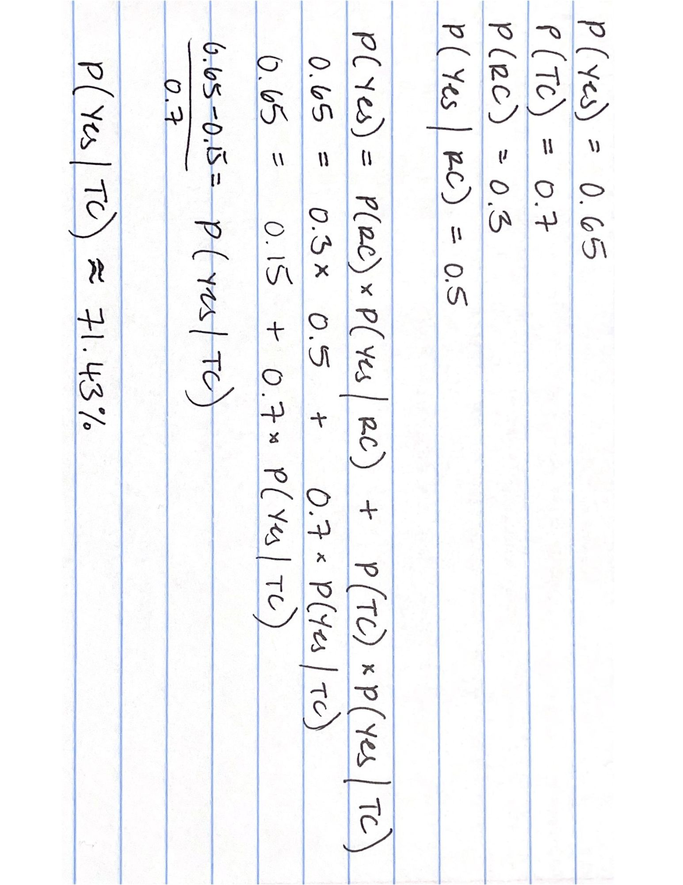
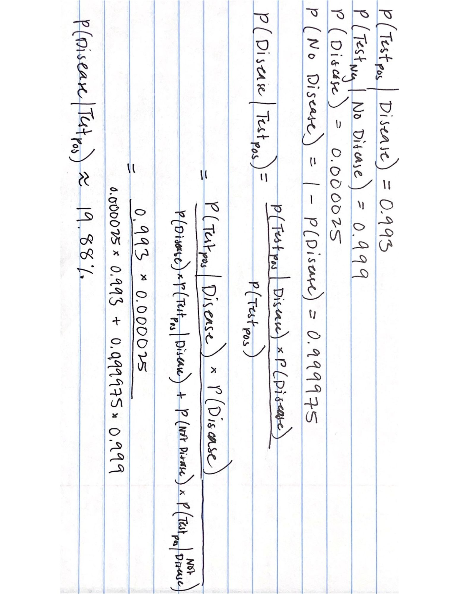

# STA380-Intro-to-ML-Exercises

## 1. Probability Practice
### **Part A** 
> Q: Visitors to your website are asked to answer a single survey question before they get access to the content on the page. Among all of the users, there are two categories: Random Clicker (RC), and Truthful Clicker (TC). There are two possible answers to the survey: yes and no. Random clickers would click either one with equal probability. You are also giving the information that the expected fraction of random clickers is 0.3. After a trial period, you get the following survey results: 65% said Yes and 35% said No. What fraction of people who are truthful clickers answered yes? Hint: use the rule of total probability.

### **Part B**
> Imagine a medical test for a disease with the following two attributes:
> 
> - The sensitivity is about 0.993. That is, if someone has the disease, there is a probability of 0.993 that they will test positive.
> - The specificity is about 0.9999. This means that if someone doesn't have the disease, there is probability of 0.9999 that they will test negative.
> - In the general population, incidence of the disease is reasonably rare: about 0.0025% of all people have it (or 0.000025 as a decimal probability).
>
> Suppose someone tests positive. What is the probability that they have the disease?

## 2. Wrangling the Billboard Top 100
**Part A**
> Make a table of the top 10 most popular songs since 1958, as measured by the total number of weeks that a song spent on the Billboard Top 100. Note that these data end in week 22 of 2021, so the most popular songs of 2021 will not have up-to-the-minute data; please send our apologies to The Weeknd.

**Part B**
> Is the "musical diversity" of the Billboard Top 100 changing over time? Let's find out. We'll measure the musical diversity of given year as the number of unique songs that appeared in the Billboard Top 100 that year. Make a line graph that plots this measure of musical diversity over the years. The x axis should show the year, while the y axis should show the number of unique songs appearing at any position on the Billboard Top 100 chart in any week that year. For this part, please filter the data set so that it excludes the years 1958 and 2021, since we do not have complete data on either of those years. Give the figure an informative caption in which you explain what is shown in the figure and comment on any interesting trends you see.

**Part C**
> Let's define a "ten-week hit" as a single song that appeared on the Billboard Top 100 for at least ten weeks. There are 19 artists in U.S. musical history since 1958 who have had at least 30 songs that were "ten-week hits." Make a bar plot for these 19 artists, showing how many ten-week hits each one had in their musical career. Give the plot an informative caption in which you explain what is shown.

Response [here](Q2/Wrangling-the-Billboard-Top-100.md).

## 3. Visual story telling part 1: green buildings
> An Austin real-estate developer is interested in the possible economic impact of "going green" in her latest project: a new 15-story mixed-use building on East Cesar Chavez, just across I-35 from downtown. Will investing in a green building be worth it, from an economic perspective? The baseline construction costs are $100 million, with a 5% expected premium for green certification.
> 
> Do you agree with the conclusions of her on-staff stats guru? If so, point to evidence supporting his case. If not, explain specifically where and why the analysis goes wrong, and how it can be improved. Do you see the possibility of confounding variables for the relationship between rent and green status? If so, provide evidence for confounding, and see if you can also make a picture that visually shows how we might "adjust" for such a confounder. Tell your story in pictures, with appropriate introductory and supporting text.

## 4. Visual story telling part 2: Capital Metro data
> Your task is to create a figure, or set of related figures, that tell an interesting story about Capital Metro ridership patterns around the UT-Austin campus during the semester in question. Provide a clear annotation/caption for each figure, but the figure(s) should be more or less stand-alone, in that you shouldn't need many, many paragraphs to convey its meaning. Rather, the figure together with a concise caption should speak for itself as far as possible.

Response [here](Q4/Visual-Story-Telling-Pt2-CapMetro.md).

## 5. Clustering and dimensionality reduction
> Run PCA, tSNE, and any clustering algorithm of your choice on the 11 chemical properties (or suitable transformations thereof) and summarize your results. Which dimensionality reduction technique makes the most sense to you for this data? Convince yourself (and me) that your chosen approach is easily capable of distinguishing the reds from the whites, using only the "unsupervised" information contained in the data on chemical properties. Does your unsupervised technique also seem capable of distinguishing the higher from the lower quality wines? Present appropriate numerical and/or visual evidence to support your conclusions.

Using PCA for clustering wine colors and t-SNE for clustering quality makes sense due to the differing complexity of each. The relationship between features and wine color is mostly linear, making PCA suitable. Conversely, the factors influencing wine quality are more complex and may require non-linear considerations, which is why t-SNE or a combination of PCA and t-SNE might be more effective. The results support this approach.

The best model for predicting wine color was K-Means clustering after PCA, which accurately clustered about 98.5% of the wines into the correct color category. However, this method performed poorly for clustering wine quality, correctly labeling only about 12.4% of the data. Incorporating t-SNE improved the accuracy by about 6%, but 16% accuracy is still quite low. This suggests that the current unsupervised technique is not very effective at distinguishing wine quality. Feature engineering and/or binning of the quality scores may enhance the accuracy.

Testing accuracy of clustering after PCA only [here](Q5/Clustering---Dimensionality-Reduction.md).

Testing accuracy of clustering after PCA and tSNE [here](Q5/Clustering-&-Dimensionality-Reduction.ipynb).

## 6. Market segmentation
> Your task to is analyze this data as you see fit, and to prepare a concise report for NutrientH20 that identifies any interesting market segments that appear to stand out in their social-media audience. You have complete freedom in deciding how to pre-process the data and how to define "market segment." (Is it a group of correlated interests? A cluster? A latent factor? Etc.) Just use the data to come up with some interesting, well-supported insights about the audience, and be clear about what you did.

## 7. The Reuters corpus
> Your task is simple: tell an interesting story, anchored in some analytical tools we have learned in this class, using this data. Describe clearly what question you are trying to answer, what models you are using, how you pre-processed the data, and so forth. Make sure you include at least one really interesting plot (although more than one might be necessary, depending on your question and approach.)
>
> Format your write-up in the following sections, some of which might be quite short:
>
> - Question: What question(s) are you trying to answer?
> - Approach: What approach/statistical tool did you use to answer the questions?
> - Results: What evidence/results did your approach provide to answer the questions? (E.g. any numbers, tables, figures as appropriate.)
> - Conclusion: What are your conclusions about your questions? Provide a written interpretation of your results, understandable to stakeholders who might plausibly take an interest in this data set.

## 8. Association rule mining
> Find some interesting association rules for these shopping baskets. The data file is a list of shopping baskets: one person's basket for each row, with multiple items per row separated by commas. Pick your own thresholds for lift and confidence; just be clear what these thresholds are and say why you picked them. Do your discovered item sets make sense? Present your discoveries in an interesting and visually appealing way.

## 9. Image classification with neural networks
> Your job is to set up a neural network that can classify the images as accurately as possible. Use an 80/20 train test split. Summarize your model and its accuracy in any way you see fit, but make you include at a minimum the following elements:
> - overall test-set accuracy, measured however you think is appropriate
> - show some of the example images from the test set, together with your model's predicted classes.
> - a confusion matrix showing the performance of the model on the set test, i.e. a table that cross-tabulates each test set example by (actual class, predicted class).

